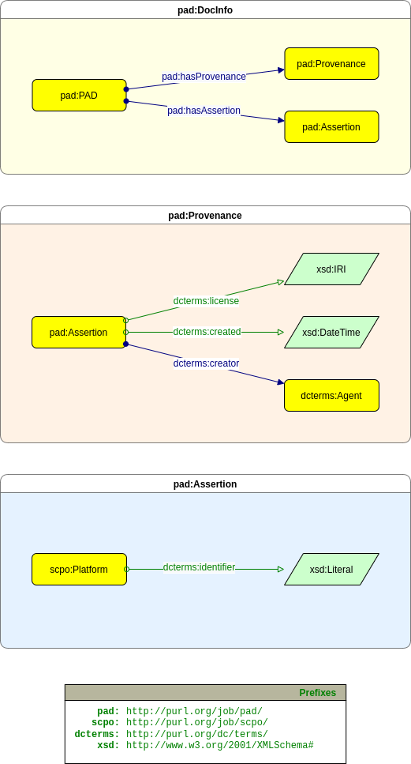
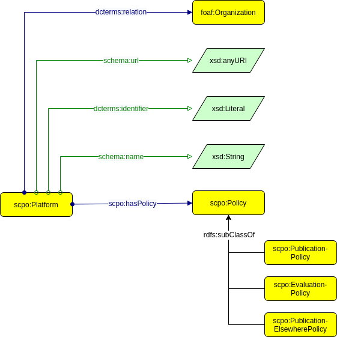
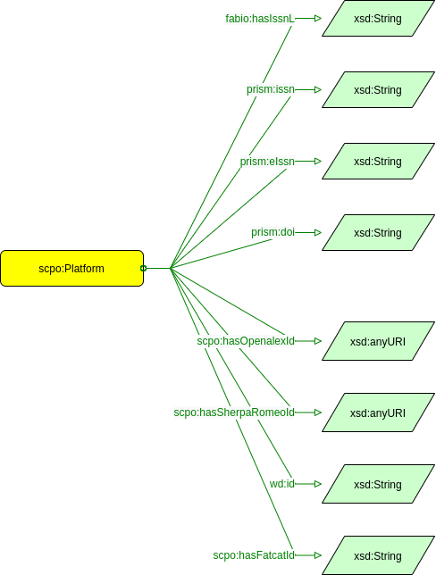
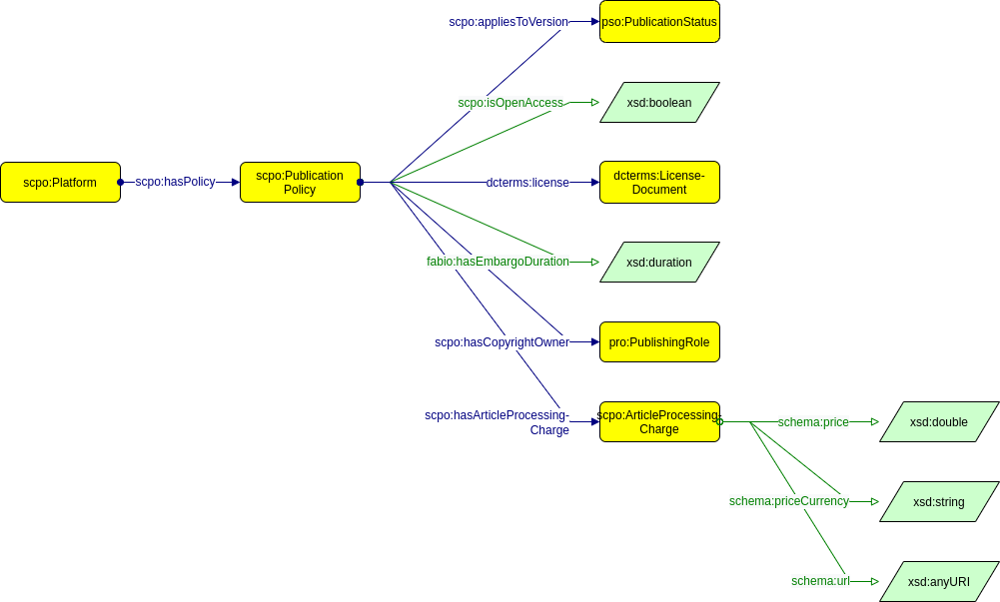
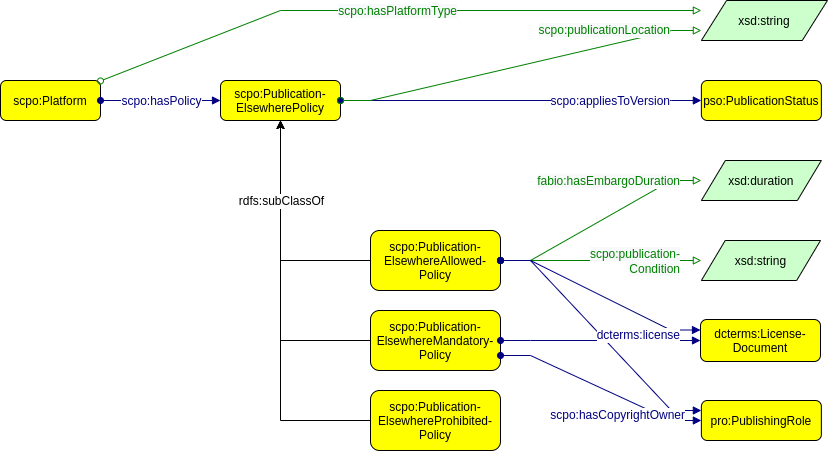
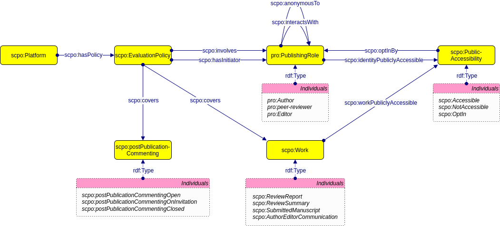

# Scholarly Communication Platform Framework

The Scholarly Communication Platform Framework consists of two core elements:
- the [Platform Assertion Document (PAD) data model](#platform-assertion-document-pad-data-model), that facilitates the exchange of information about scholarly communication platforms in a machine-readable and traceable way, and
- the [Scholarly Communication Platform (SCPO) Ontology](#scholarly-communication-platform-scpo-ontology) for describing specific properties of scholarly communication platforms.

## Platform Assertion Document (PAD) data model

### PAD ID

PADs are not designed to be used independently of each other, as they describe some aspects of a platform. This platform has an identifier, which we picked as the ISSN-L. However, there can be multiple PADs that describe a single platform, therefore the ISSN-L is not suitable for identifying a PAD. There are a few options for PAD identifiers:

#### 1. Blank nodes
In RDF, an object or subject in a triple can be a 'blank node', this is a unique identifier that is only usable within the context of that triple store. Most serialization formats obfuscate the actual identifier. Blank nodes are mostly used for the purposes of nesting and ordering of items.

##### Pros
- Blank nodes can be generated within the SPARQL query that converts the data into PADs. The query stays relatively simple.
##### Cons
- Because identifiers are generated at random at each step of the query, poorly defined queries can lead to duplication of data. Queries can get relatively complex when trying to work around this duplication.
- When serializing, the data can become hard to read.
- Identifiers do not carry over outside of linked data. There is no url-scheme to refer to the PAD outside of the RDF store.

#### 2. UUIDs
A UUID is a random string of letters and numbers, which is extremely unlikely to produce collisions. Combining this with an url-scheme like <https://journalobservatory.org/[UUID]> gives us both a proper identifier and a url to incorporate into the Journal Observatory API.

##### Pros
- The UUID carries over outside of the context of RDF. The identifier can be used in other data formats.
- The identifier can be generated using SPARQL.
##### Cons
- The UUID has no semantic value.
- The UUID needs to be generated before constructing the PAD and injected during the SPARQL query. This can be done using prefixes, but makes constructing the RDF store slightly problematic. Alternatively, the UUID can be generated within the SPARQL query, but this makes constructing the query properly more complex.
- Updating PADs is problematic

#### 3. Identifier scheme
When converting the data, we have some properties that are mandatory for creating a PAD: The ISSN-L of the journal that is being asserted, the name of the data-source of the assertion and the timestamp at which moment the assertion was created. Combining this in the following url-schema: <https://journalobservatory.org/[issn-l]/[data-source]/[timestamp]> gives us a proper identifier.

##### Pros
- The identifier has a semantic value.
- The identifier creates an hierarchical schema for the Journal Observatory API.
- The identifier can be generated using SPARQL.
##### Cons
- There is a chance of identifier collisions.
- The identifier is dependent on the quality of its parts (malformed timestamps/issn/etc).

## Scholarly Communication Platform (SCPO) Ontology

### Platform

### Identifier

### Publication Policy

### Publication Elsewhere Policy

### Evaluation Policy

